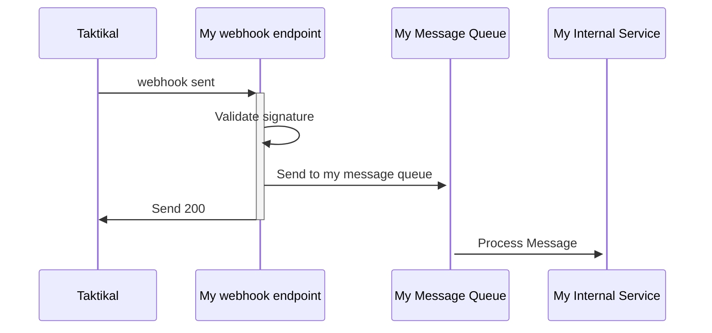

import Tabs from "@theme/Tabs";
import TabItem from "@theme/TabItem";

After a document has been signed it can be delivered back to your system.

## Definition of terms

The following keys are needed to work with webhooks.

- `companyKey` the baseKey used to identify a company.
- `flowKey` There can be many flows each with its own delivery methods
  registered.
- `webhookSignatureKey` The key used to validate that Taktikal sends the webhook
  data.

## Webhook

The data Taktikal sends via webhook are wrapped in a `WebhookEventPayload`
object that has an `Id`, `EventData`, and `EventSignature` See example data
below.

- `EventSignature` is used to validate that Taktikal is the one who sends the
  data. `TimeStamp` and `GUID` hashed with the `webhookSignatureKey` to create a
  `Signature`. If the `Signature` that is calculated is not a match to the value
  in the event, it was not sent by Taktikal.
- `EventData` contains all `signee` that signed the document and all their
  personal information provided in this process. The signed document is stored
  as a base64 string in the field `SignedDocument`

Taktikal will send a POST request to the registered URL when an event occurs and
expects an HTTP Status code 200 Response. For all other response codes, Taktikal
Will retry two more times. Unless an HTTP Status code 406 (not accepted) is
received that marks that we will not try again.

## Webhook event types

Taktikal sents out webhook events for `Created`, `SignedDocument`, `AllSigned`,
`Canceled` or `Expired`,

| Event name       |  Event description                                                                                 | contains document  | integer value |
| ---------------- | -------------------------------------------------------------------------------------------------- | ------------------ | ------------- |
| `Created`        | This is an event that is triggerd when a new signing process is created.                           | :red_circle:       | 11            |
| `SignedDocument` | This is an event that is run for each signing except the last one.                                 | :red_circle:       | 1             |
| `AllSigned`      | This is an event triggered on the last signature.                                                  | :white_check_mark: | 2             |
| `Canceled`       | This is an event that is run when a signing process is canceled.                                   | :red_circle:       | 5             |
| `Expired`        | each signing process needs to be signed within 30 days. If it expires this event will be triggered | :white_check_mark: | 6             |

## Register a webhook

Webhooks can be managed via the API. All routes can be viewed in Swagger
[here](https://onboarding.taktikal.is/api/swagger-ui/#/webhook).

## AttachmentReferences

A signing process can have AttachmentReferences. Each AttachmentReference has
`AttachmentType`. That can be any of the values in the table

| AttachmentType     | Value | Description                                                                                                |
| ------------------ | ----- | ---------------------------------------------------------------------------------------------------------- |
| Unspecified        | 0     | this is the most common value. It's used for all regular attachments.                                      |
| EvidencePage       | 10    | for standart signatures and advanced signatures, an EvidencePage is generated and seald by Taktikal        |
| PepPdf             | 20    | a PDF file contaning PEP and sactions results for a signee in an AML process that is seald by Taktikal     |
| PepJson            | 30    | a JSON file contaning PEP and sactions results for a signee in an AML process                              |
| Verification       | 40    | for advanced signatures all attachments related to identify the signee have this attachment type.         |
| XmlForSealing      | 50    | an xml attachment that is selead and added as an embedded attachment to the PDF when it's signed           |
| VerificationMedia  | 60    | images that are collected during the ID verification process                                              |
| CompanyInfo        | 70    | Company report used in AML processes. compare the answeres to the official company data from the goverment |

## Recommended approach

When you receive a webhook event, we recommend that you offload it to your own
message queue service for further processing and respond to us with Http status
code `200`.

This minimizes the risk of data loss as any error during processing of message
can be seen and replayed within your own infrastructure.



## Code examples

### Example webhook event

```json
{
  "Id": "3e9922f5fd7f4a9baa75a3fa90cb9caf",
  "EventData": {
    "CompanyKey": "fae93sfa4sh4",
    "Signees": [
      {
        "Name": "Test User",
        "Ssn": "1234567890",
        "PhoneNumber": "1234567",
        "Email": "testUser@taktikal.com",
        "Address": "Address 5",
        "City": "Reykjavík",
        "Key": "si7abef56540bd49f9a9b8a33969a9cf8c",
        "Signed": true,
        "SignedAt": "yyyy-MM-ddTHH:mm:ss.fffffZ",
        "ProcessKey": "sp231f52f87d6f4caaa2e29ecac92d055b",
        "CommunicationDeliveryType": "Email"
      }
    ],
    "FlowKey": "722989cac3fx",
    "FlowName": "Non-disclosure agreement",
    "SignedDocument": "JVBERi0xLjQ...",
    "AttachmentReferences": [
      {
        "Id": "at3357",
        "FileName": "pep-Test User-63f-1.pdf",
        "ContentLength": 90570,
        "ContentType": "application/pdf",
        "Url": "https://app.taktikal.is/attachment/sp231f52f87d6f4caaa2e29ecac92d055b/at3357/pep-Test User-64f-1.pdf",
        "Description": "PEP for Test User",
        "ProcessKey": "sp231f52f87d6f4caaa2e29ecac92d055b",
        "AttachmentType": 20,
        "SigneeKey": "si7abef56540bd49f9a9b8a33969a9cf8c"
      }
    ],
    "EventType": 2, // "AllSigned",
    "Meta": {
      "pdfUrl": "https://fill.dropandsign.is/api/flow/665a62b4a97a/pdf",
      "pdfFieldData": "{\"Nafn\":\"Test User\",\"userInfo\":\"info\",\"ssn\":\"123456-7890\"}"
    }
  },
  "EventSignature": {
    "TimeStamp": 637030223561542290,
    "Guid": "2065b6c0-934f-4d18-81d3-46c29b913311",
    "Signature": "5qN29xaZHKZ65PLMB6ajRgpcxUU9dFRAXhkw36C2d38="
  }
}
```

<Tabs
  defaultValue="csharp"
  values={[
    { label: 'C#', value: 'csharp' },
    { label: 'TypeScript', value: 'ts' },
  ]}>
  <TabItem value="csharp">

```csharp
using System;
using System.Collections.Generic;
using System.Security.Cryptography;
using System.Text;

namespace Webhook
{
    public class WebhookEventPayload
    {
        public Guid Id { get; set; }
        public SignedDocumentEventData EventData { get; set; }
        public EventSignature EventSignature { get; set; }
    }

    /// <summary>
    /// The signature section that will be in all webhook payloads. Used to validate the payload
    /// </summary>
    public class EventSignature
    {
        public long TimeStamp { get; set; }
        public string Guid { get; set; }
        public string Signature { get; set; }
    }

    public class SignedDocumentEventData
    {
        public List<Signee> Signees { get; set; }
        public string SignedDocument { get; set; }
        public List<AttachmentReference> AttachmentReferences { get; set; }
        public EventType EventType { get; set; }
        public Dictionary<string, string> Meta { get; set; }
    }

    public class AttachmentReference
    {
        public string Id { get; set; }
        public string FileName { get; set; }
        public long ContentLength { get; set; }
        public string ContentType { get; set; }
        public string Url { get; set; }
        public string Description { get; set; }
        public string ProcessKey { get; set; }

        public AttachmentType AttachmentType { get; set; } = AttachmentType.Unspecified;
        public string SigneeKey { get; set; }
    }

    public enum AttachmentType
    {
        Unspecified = 0,
        EvidencePage = 10,
        PepPdf = 20,
        PepJson = 30,
        Verification = 40,
        XmlForSealing = 50,
        VerificationMedia = 60, // additional data collected during verification
        CompanyInfo = 70
    }

    public enum EventType
    {
        SignedDocument = 1,
        AllSigned = 2,
        Canceled = 5,
        Expired = 6,
        /// <summary>
        /// This is an event that is triggered when all jobs have finished running for a process
        /// </summary>
        Completed = 10,

        /// <summary>
        /// This is an event that is triggered when a process is created to trigger all signingRequests
        /// </summary>
        Created = 11
    }

    public class Signee
    {
        public string Name { get; set; }
        public string Ssn { get; set; }
        public string PhoneNumber { get; set; }
        public string Email { get; set; }
        public string Address { get; set; }
        public string PostalCode { get; set; }
        public string City { get; set; }
        public string Key { get; set; }
        public bool Signed { get; set; }
        public string ProcessKey { get; set; }
        public string CommunicationDeliveryType { get; set; }
    }

    public static class WebhookHelpers
    {
        /// <summary>
        /// Verifies that signature matches your webhook signature key
        /// </summary>
        public static bool ValidateSignature(this WebhookEventPayload webhookEvent, string yourWebhookSignatureKey)
        {
            var encoding = new UTF8Encoding();
            byte[] keyByte = encoding.GetBytes(yourWebhookSignatureKey);
            byte[] messageBytes = encoding.GetBytes($"{webhookEvent.EventSignature.TimeStamp}{webhookEvent.EventSignature.Guid}");
            using (var hmacsha256 = new HMACSHA256(keyByte))
            {
              byte[] hashmessage = hmacsha256.ComputeHash(messageBytes);
              return Convert.ToBase64String(hashmessage) == webhookEvent.EventSignature.Signature;
            }
        }
    }
}
```

</TabItem>
<TabItem value="ts">

```tsx
import crypto from "crypto";

interface IEventSignature {
  TimeStamp: string;
  Guid: string;
  Signature: string;
}

const validateSignature = (options: {
  signaturePayload: IEventSignature;
  webhookSignatureKey: string;
}) => {
  const { signaturePayload, webhookSignatureKey } = options;

  const keyByte = Buffer.from(webhookSignatureKey, "utf8");
  const messageBytes = Buffer.from(
    `${signaturePayload.TimeStamp}${signaturePayload.Guid}`,
    "utf8"
  );

  const hmacSha256 = crypto.createHmac("sha256", keyByte);
  const hashMessage = hmacSha256.update(messageBytes).digest("base64");

  return hashMessage === signaturePayload.Signature;
};

const validSignature = validateSignature({
  signaturePayload: {
    TimeStamp: "638327870864528186",
    Guid: "4071a0c4-e8c9-432c-8031-7d86ca217b12",
    Signature: "NOUtCpHdAyQte6LDcNws4U4qw2vQVhrS4s8YX8=",
  },
  webhookSignatureKey: <TAKTIKAL_WEBHOOK_SIGNATURE_KEY>,
});
```

</TabItem>
</Tabs>
